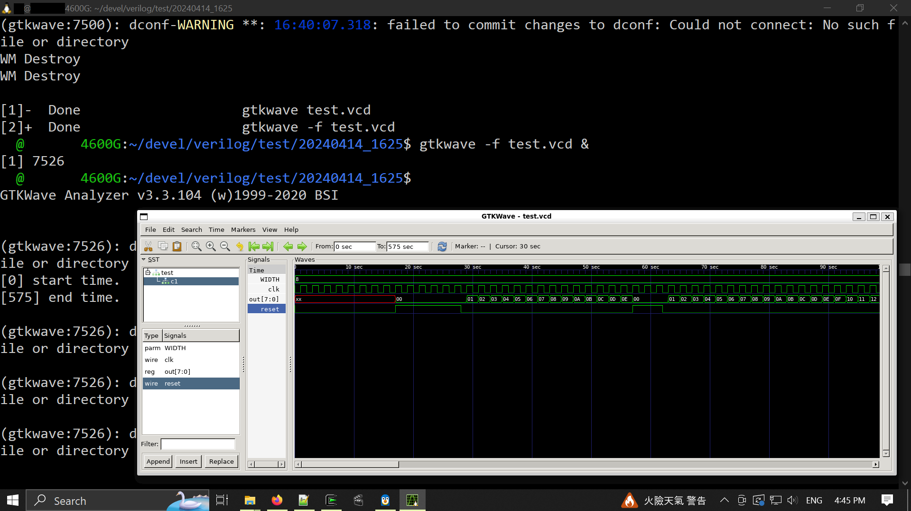

BLOG_GitHub_IverilogGTKwave_20240114.txt  
  https://github.com/kwankunghkg/EECS-semiconductors/blob/main/IC/Verilog/IverilogGTKwave/IverilogGTKwave.md  
  
  
last update : 20250804_2024(UTC+8)  
prev update : 20250728_1727(UTC+8)  
prev update : 20250726_1054(UTC+8)  
prev update : 20240114_1700(UTC+8)  
  
--------------------------------------------------  
  
## WSL2+Iverilog+GTKwave  
  
  
  
----------------------------------------  
  
  
  
----  
  
sudo apt install gtkwave  
  
  
----  
  
linux iverilog install  
  https://steveicarus.github.io/iverilog/usage/installation.html  
% git config --global user.name "Your Name Goes Here"  
% git config --global user.email you@yourpublicemail.example.com  
% git clone https://github.com/steveicarus/iverilog.git  
  
  
----  
  
install bison, flex, g++ and gcc  
  
% ./configure  
% make  
(su to root)  
% sudo make install  
  
  
----  
  
autoconf complains "C compiler cannot create executables" on Linux Mint  
  https://stackoverflow.com/questions/20678016/autoconf-complains-c-compiler-cannot-create-executables-on-linux-mint  
  
  
  
----  
  
vi hello.v  
  
```  
module hello;  
  initial  
    begin  
      $display("Hello, World");  
      $finish ;  
    end  
endmodule  
```  
  
----  
  
iverilog -o hello hello.v  
vvp hello  
  
  
  
----  
  
  https://physerver.hamilton.edu/people/bcollett/Verilog1.html  
  
counter.v  
  
```  
  
module counter(out, clk, reset);  
  
parameter WIDTH = 8;  
  
output [WIDTH-1 : 0] out;  
input clk, reset;  
  
reg [WIDTH-1 : 0]   out;  
wire clk, reset;  
  
always @(posedge clk)  
    out <= out + 1;  
  
always @reset  
    if (reset)  
        assign out = 0;  
    else  
        deassign out;  
  
endmodule // counter  
  
```  
  
----  
  
----  
  
  
counter_reset.v  
  
```  
module counter(out, clk, reset);  
  
parameter WIDTH = 8;  
  
output [WIDTH-1 : 0] out;  
input clk, reset;  
  
reg [WIDTH-1 : 0]   out;  
wire clk, reset;  
  
always @(posedge reset or posedge clk)  
    if (reset)  
        out <= 0;  
    else  
        out <= out + 1;  
  
endmodule // counter  
  
```  
  
  
  
----  
  
----  
  
Generate .vcd File for Verilog w/ GTKwave  
  https://www.physicsforums.com/threads/generate-vcd-file-for-verilog-w-gtkwave.447739/#google_vignette  
  
  
  
----  
  
----  
  
test.v  
  
```  
  
module test;  
  
/* Make a reset that pulses once. */  
reg reset = 0;  
initial begin  
    $dumpfile("test.vcd");  
    $dumpvars(0,test);  
    # 17 reset = 1;  
    # 11 reset = 0;  
    # 29 reset = 1;  
    # 5 reset =0;  
    # 513 $finish;  
end  
  
/* Make a regular pulsing clock. */  
reg clk = 0;  
always #1 clk = !clk;  
  
wire [7:0] value;  
counter c1 (value, clk, reset);  // instantiate DeviceUnderTest  
  
initial  $monitor("At time %t, value = %h (%0d)", $time, value, value);  
  
endmodule // test  
  
```  
  
----  
  
  
----  
  
  
  
```  
  
vi test.v  
nano counter_reset.v  
less counter_reset.v  
ls -al  
iverilog -o test test.v counter_reset.v  
vvp test  
gtkwave -f test.vcd &  
history | tail -10  
  
```  
  
  
  
----  
  
  
----  
  
  
    
  
  
----  
  
  
----  
  
  
----  
  
  
----  
  
## power shell  
  
  
```  
  
  
Windows PowerShell  
Copyright (C) Microsoft Corporation. All rights reserved.  
Try the new cross-platform PowerShell https://aka.ms/pscore6  
  
PS C:\Users\kwank> wsl  
  
Welcome to Ubuntu 22.04.2 LTS (GNU/Linux 6.6.87.2-microsoft-standard-WSL2 x86_64)  
  
kk@FACTOR-4600G:/mnt/c/Users/kk$ cd  
  
kk@FACTOR-4600G:~$ pwd  
/home/kk  
  
kk@FACTOR-4600G:~$ type aliases  
aliases is aliased to `source ~/.bash_aliases'  
  
kk@FACTOR-4600G:~$ type aliased  
aliased is aliased to `vi ~/.bash_aliases'  
  
kk@FACTOR-4600G:~$ type ll  
ll is aliased to `ls -al --group-directories-first'  
  
kk@FACTOR-4600G:~$ type datenow  
datenow is aliased to `export datenow="_`date +%Y%m%d_%H%M%S`" ; echo ${datenow} '  
  
kk@FACTOR-4600G:~$ type hist  
hist is aliased to `history'  
  
kk@FACTOR-4600G:~/devel/verilog/test/20240414_1625/counter_reset$ cat ~/.bash_aliases  
  
alias datenow='export datenow="_`date +%Y%m%d_%H%M%S`" ; echo ${datenow} '  
alias hist='history'  
alias his='history'  
alias hislog='history > ~/hist`datenow`.log'  
alias sync='sync;sync;sync'  
  
  
  
  \\wsl$\home\kwankunghkg\devel\verilog\test\20240414_1625\iverilog_hist_20240114.log  
  \\wsl.localhost\Ubuntu\home\kwankunghkg\devel\verilog\test\20240414_1625\iverilog_hist_20240114.log  
  
  
history : WSL2  
  
  141  uname -a  
  145  gimp&  
  146  ll  
  147  sudo apt install gtkwave  
  148  type gtkwave  
  149  gtkwave &  
  154  git config --global user.name "kwankunghkg"  
  155  git config --global user.email "kwankunghkg@email.com"  
  156  git clone https://github.com/steveicarus/iverilog.git  
  157  ll  
  158  cd iverilog/  
  169  sh autoconf.sh  
  170  less autoconf.sh  
  171  less -N autoconf.sh  
  172  type gperf  
  175  type autoconf  
  177  sudo apt install autoconf  
  178  type gperf  
  179  type autoconf  
  180  ll  
  181  sh autoconf.sh  
  182  type bison  
  183  sudo apt install bison  
  184  type flex  
  185  sudo apt install flex  
  186  sudo apt install flex  --fix-missing  
  189  type flex  
  190  type g++  
  191  type gcc  
  192  sudo apt install g++  
  193  sudo apt install g++ --fix-missing  
  194  type g++  
  195  sudo apt install gcc  
  196  type gcc  
  197  ./configure  
  198  less config.log  
  199  type gcc  
  200  gcc -V  
  201  gcc -v  
  202  less -N config.log  
  203  gcc --help  
  204  less -N config.log  
  205  sudo apt-get install build-essential  
  206  sudo apt-get install build-essential  --fix-broken  
  207  sudo apt-get install  --fix-broken build-essential  
  208  sudo apt --fix-broken install  
  209  sudo apt --fix-broken install  --fix-missing  
  210  sudo apt-get update  
  211  sudo apt --fix-broken install  --fix-missing  
  212  ./configure  
  213  make  
  214  sudo apt install make  
  215  sudo apt install make-guile  
  216  make  
  229  su  
  230  sudo make install  
  231  ll  
  232  type iverilog  
  233  pwd  
  234  ..  
  235  cd devel/  
  236  ll  
  237  mkdir verilog  
  238  cd verilog  
  239  mkdir test  
  240  cd test  
  241  mkdir 20240414_1625  
  242  cd 20240414_1625  
  243  date  
  244  type datenow  
  245  datenow  
  246  nano  
  247  ll  
  248  iverilog -o hello hello.v  
  249  ll  
  250  type vvp  
  251  vvp hello  
  256  vi test.v  
  257  vi counter.v  
  259  less -N counter.v  
  260  less -N test.v  
  261  iverilog -o test test.v counter.v  
  262  ll  
  263  vvp test  
  264  ll  
  266  gtkwave --help  
  267  gtkwave -f test.vcd &  
  276  hist | tail -200 > hist`datenow`.log  
  277  less -N hist_20240114_165318.log  
  278  ll  
  
```  
  
  
  
----  
  
  
----  
  
  
  
----  
  
history : Raspberry Pi  
  
  
```  
kk@rpi5:~/devel/verilog/test/counter $ type ll  
ll is aliased to `ls -al --group-directories-first'  
  
kk@rpi5:~/devel/verilog/test/counter $ type lll  
lll is aliased to `ls -ld */'  
  
kk@rpi5:~/devel/verilog/test/counter $ type datenow  
datenow is aliased to `export datenow="_`date +%Y%m%d_%H%M%S`" ; echo ${datenow} '  
  
kk@rpi5:~/devel/verilog/test/counter $ type hislog  
hislog is aliased to `history > ~/hist`datenow`.log'  
  
  
  
  2001  sudo apt install gtkwave  
  2002  gtkwave &  
  2003  type gcc  
  2004  type g++  
  2013  type autoconf  
  2014  sudo apt install autoconf  
  2016  type autoconf  
  2015  sudo apt install gperf  
  2017  type gperf  
  2020  sudo apt install flex  
  2021  type flex  
  2022  type bison  
  2023  sudo apt install bison  
  2024  type bison  
  2005  git clone https://github.com/steveicarus/iverilog.git  
  2006  lll  
  2007  cd iverilog/  
  2008  ll  
  2009  ./configure  
  2010  sh autoconf.sh  
  2011  sudo sh autoconf.sh  
  2012  sh ./autoconf.sh  
  2018  sh ./autoconf.sh  
  2019  ./configure  
  2025  ./configure  
  2026  make  
  2027  sudo make install  
  2028  ll  
  2029  type vvp  
  2030  type iverilog  
  2031  cd ..  
  2032  cd devel/  
  2033  ll  
  2034  md verilog  
  2035  cd verilog  
  2036  vi hello.v  
  2037  iverilog -o hello hello.v  
  2038  ll  
  2039  md hello  
  2040  md test  
  2041  md test/hello  
  2042  mv hello.* test/hello  
  2043  ll test/hello  
  2044  ll  
  2045  ll hello  
  2046  ll  
  2047  mv hello test/hello//.  
  2048  ll test/hello  
  2049  cd test/hello  
  2050  ..  
  2051  md counter  
  2052  cd counter  
  2053  ll  
  2054  vi counter.v  
  2055  vi test.v  
  2056  iverilog -o test.o test.v counter.v  
  2057  vvp test.o  
  2058  ll  
  2059  gtkwave -f test.vcd &  
  2061  type hislog  
  2062  hislog  
   
```  
  
  
  
----  
  
  
----  
  
  
----  
  
  
  
----  
End of File.  
